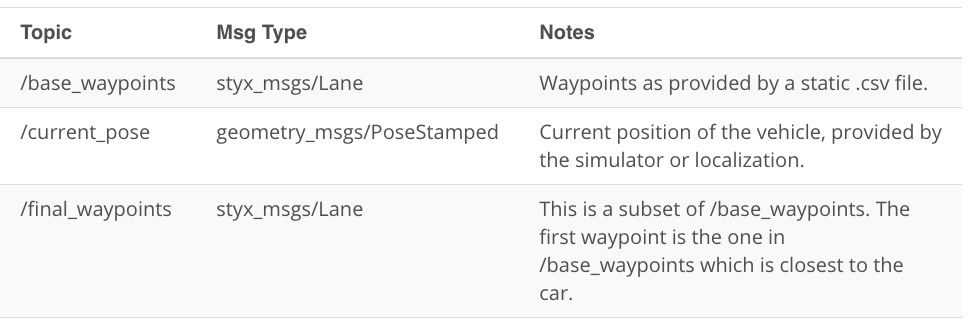

## System Architecture Diagram
For this project, I wrote ROS nodes to implement core functionality of an autonomous vehicle system, including traffic light detection, control, and waypoint following! 

The following is a system architecture diagram showing the ROS nodes and topics used in the project. The ROS nodes and topics shown in the diagram are described briefly in the Code Structure section below.


## Code Structure
Below is a brief overview of the repo structure, along with descriptions of the ROS nodes. The code that you will need to modify for the project will be contained entirely within the (path_to_project_repo)/ros/src/ directory. Within this directory, you will find the following ROS packages:

### (path_to_project_repo)/ros/src/tl_detector/
This package contains the traffic light detection node: tl_detector.py. This node takes in data from the /image_color, /current_pose, and /base_waypoints topics and publishes the locations to stop for red traffic lights to the /traffic_waypoint topic.

The /current_pose topic provides the vehicle's current position, and /base_waypoints provides a complete list of waypoints the car will be following.

 Traffic light detection takes place within tl_detector.py, whereas traffic light classification should take place within ../tl_detector/light_classification_model/tl_classfier.py.


### (path_to_project_repo)/ros/src/waypoint_updater/
This package contains the waypoint updater node: waypoint_updater.py. The purpose of this node is to update the target velocity property of each waypoint based on traffic light and obstacle detection data. This node will subscribe to the /base_waypoints, /current_pose, /obstacle_waypoint, and /traffic_waypoint topics, and publish a list of waypoints ahead of the car with target velocities to the /final_waypoints topic.


### (path_to_project_repo)/ros/src/twist_controller/
Carla (Self driving car platform) is equipped with a drive-by-wire (dbw) system, meaning the throttle, brake, and steering have electronic control. This package contains the files that are responsible for control of the vehicle: the node dbw_node.py and the file twist_controller.py, along with a pid and lowpass filter that you can use in your implementation. The dbw_node subscribes to the /current_velocity topic along with the /twist_cmd topic to receive target linear and angular velocities. Additionally, this node will subscribe to /vehicle/dbw_enabled, which indicates if the car is under dbw or driver control. This node will publish throttle, brake, and steering commands to the /vehicle/throttle_cmd, /vehicle/brake_cmd, and /vehicle/steering_cmd topics.


The styx and styx_msgs packages are used to provide a link between the simulator and ROS, and to provide custom ROS message types:

  * (path_to_project_repo)/ros/src/styx/
  A package that contains a server for communicating with the simulator, and a bridge to translate and publish simulator messages to ROS topics.

  * (path_to_project_repo)/ros/src/styx_msgs/
  A package which includes definitions of the custom ROS message types used in the project.

  * (path_to_project_repo)/ros/src/waypoint_loader/
  A package which loads the static waypoint data and publishes to /base_waypoints.
  (path_to_project_repo)/ros/src/waypoint_follower/

  * A package containing code from Autoware which subscribes to /final_waypoints and publishes target vehicle linear and angular velocities in the form of twist commands to the /twist_cmd topic.

## Waypoint Updater Node Overview

### (path_to_project_repo)/ros/src/waypoint_updater/waypoint_updater.py

The /base_waypoints topic publishes a list of all waypoints for the track, so this list includes waypoints both before and after the vehicle (note that the publisher for /base_waypoints publishes only once). For this step in the project, the list published to /final_waypoints should include just a fixed number of waypoints currently ahead of the vehicle:

  * The first waypoint in the list published to /final_waypoints should be the first waypoint that is currently ahead of the car.
  * The total number of waypoints ahead of the vehicle that should be included in the /final_waypoints list is provided by the LOOKAHEAD_WPS variable in waypoint_updater.py.

## Waypoint Message Descriptions

From the code in waypoint_updater.py, we can see that both the /final_waypoints and /base_waypoints topics have message type Lane. You can look at the details about this message type in <path_to_project_repo>/ros/src/styx_msgs/msg/, but this can also be done from the command line after launching the ROS project using rostopic and rosmsg as follows:

After opening a new terminal window and sourcing devel/setup.bash, you can see see all topics by executing:

$ rostopic list
You should see /final_waypoints among the topics. Executing:

$ rostopic info /final_waypoints
will provide info about the message type being used in /final_waypoints:

Type: styx_msgs/Lane
Next executing:

$ rosmsg info styx_msgs/Lane
provides the following message information:

- std_msgs/Header header
  - uint32 seq
  - time stamp
  - string frame_id
- styx_msgs/Waypoint[] waypoints
  - geometry_msgs/PoseStamped pose
    - std_msgs/Header header
      - uint32 seq
      - vtime stamp
      - string frame_id
    - geometry_msgs/Pose pose
      - geometry_msgs/Point position
        - float64 x
        - float64 y
        - float64 z
      - geometry_msgs/Quaternion orientation
        - float64 x
        - float64 y
        - float64 z
        - float64 w
  - geometry_msgs/TwistStamped twist
    - std_msgs/Header header
      - uint32 seq
      - time stamp
      - string frame_id
    - geometry_msgs/Twist twist
      - geometry_msgs/Vector3 linear
        - float64 x
        - float64 y
        - float64 z
      - geometry_msgs/Vector3 angular
        - float64 x
        - float64 y
        - float64 z

Each waypoint has pose and twist data. Going further, you can see that twist.twist data contains 3D linear and angular velocities.

Lane message example
As a use-case example, given a single styx_msgs/Lane message my_lane_msg, you can access the x direction linear velocity of the first waypoint in Python with:

my_lane_msg[0].twist.twist.linear.x
Note that the coordinates for linear velocity are vehicle-centered, so only the x-direction linear velocity should be nonzero.

Topics and message types




## DBW Node Overview

Once messages are being published to /final_waypoints, the vehicle's waypoint follower will publish twist commands to the /twist_cmd topic. The goal for this part of the project is to implement the drive-by-wire node (dbw_node.py) which will subscribe to /twist_cmd and use various controllers to provide appropriate throttle, brake, and steering commands. These commands can then be published to the following topics:

/vehicle/throttle_cmd
/vehicle/brake_cmd
/vehicle/steering_cmd
Since a safety driver may take control of the car during testing, you should not assume that the car is always following your commands. If a safety driver does take over, your PID controller will mistakenly accumulate error, so you will need to be mindful of DBW status. The DBW status can be found by subscribing to /vehicle/dbw_enabled.

When operating the simulator please check DBW status and ensure that it is in the desired state. DBW can be toggled by clicking "Manual" in the simulator GUI.

All code necessary to implement the drive-by-wire node can be found in the package:

(path_to_project_repo)/ros/src/twist_controller


### Twist controller package files
Within the twist controller package, you will find the following:

* dbw_node.py
This python file implements the dbw_node publishers and subscribers. This file also imports the Controller class from twist_controller.py which will be used for implementing the necessary controllers. The function used to publish throttle, brake, and steering is publish.

Note that throttle values passed to publish should be in the range 0 to 1, although a throttle of 1 means the vehicle throttle will be fully engaged. Brake values passed to publish should be in units of torque (N*m).

* twist_controller.py
The control method can take twist data as input and return throttle, brake, and steering values. Within this class, you can import and use the provided pid.py and lowpass.py if needed for acceleration, and yaw_controller.py for steering.

* yaw_controller.py
A controller that to convert target linear and angular velocity to steering commands.

* pid.py
A generic PID controller in twist_controller.py.

* lowpass.py
A generic low pass filter in twist_controller.py.

* dbw_test.py
You can use this file to test your DBW code against a bag recorded with a reference implementation. The bag can be found at https://s3-us-west-1.amazonaws.com/udacity-selfdrivingcar/files/reference.bag.zip


## Native Installation

* Be sure that your workstation is running Ubuntu 16.04 Xenial Xerus or Ubuntu 14.04 Trusty Tahir. [Ubuntu downloads can be found here](https://www.ubuntu.com/download/desktop).
* If using a Virtual Machine to install Ubuntu, use the following configuration as minimum:
  * 2 CPU
  * 2 GB system memory
  * 25 GB of free hard drive space

  The Udacity provided virtual machine has ROS and Dataspeed DBW already installed, so you can skip the next two steps if you are using this.

* Follow these instructions to install ROS
  * [ROS Kinetic](http://wiki.ros.org/kinetic/Installation/Ubuntu) if you have Ubuntu 16.04.
  * [ROS Indigo](http://wiki.ros.org/indigo/Installation/Ubuntu) if you have Ubuntu 14.04.
* Download the [Udacity Simulator](https://github.com/udacity/CarND-Capstone/releases).

### Docker Installation
[Install Docker](https://docs.docker.com/engine/installation/)

Build the docker container
```bash
docker build . -t capstone
```

Run the docker file
```bash
docker run -p 4567:4567 -v $PWD:/capstone -v /tmp/log:/root/.ros/ --rm -it capstone
```
### Simulator Testing

The following simulator models the self driving car platform that was used and can be used to test out the ROS nodes and car functionality:
https://github.com/udacity/CarND-Capstone/releases

The simulator should display images using a unity enginer that look like:


### Usage

1. Clone the project repository
```bash
git clone https://github.com/udacity/CarND-Capstone.git
```

2. Install python dependencies
```bash
cd CarND-Capstone
pip install -r requirements.txt
```
3. Make and run styx
```bash
cd ros
catkin_make
source devel/setup.sh
roslaunch launch/styx.launch
```
4. Run the simulator

### Real world testing
1. Download [training bag](https://s3-us-west-1.amazonaws.com/udacity-selfdrivingcar/traffic_light_bag_file.zip) that was recorded on the Udacity self-driving car.
2. Unzip the file
```bash
unzip traffic_light_bag_file.zip
```
3. Play the bag file
```bash
rosbag play -l traffic_light_bag_file/traffic_light_training.bag
```
4. Launch your project in site mode
```bash
cd CarND-Capstone/ros
roslaunch launch/site.launch
```
5. Confirm that traffic light detection works on real life images

### Other library/driver information
Outside of `requirements.txt`, here is information on other driver/library versions used in the simulator and Carla:

Specific to these libraries, the simulator grader and Carla use the following:

|        | Simulator | Carla  |
| :-----------: |:-------------:| :-----:|
| Nvidia driver | 384.130 | 384.130 |
| CUDA | 8.0.61 | 8.0.61 |
| cuDNN | 6.0.21 | 6.0.21 |
| TensorRT | N/A | N/A |
| OpenCV | 3.2.0-dev | 2.4.8 |
| OpenMP | N/A | N/A |
